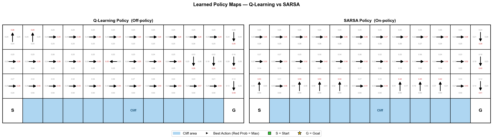
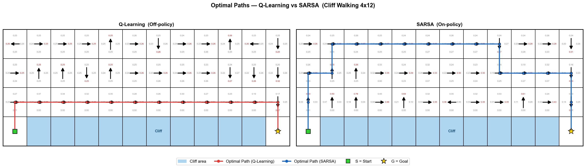

# A Comparative Study of Q-Learning and SARSA Algorithms

> **Course:** Deep Reinforcement Learning — Assignment 2  
> **Task:** Implement and compare Q-Learning (Off-policy) vs. SARSA (On-policy) on the Cliff Walking environment  
> **Hardware:** NVIDIA GeForce RTX 4060 Laptop GPU · CUDA 12.1 · cuDNN 9  

---

## 📋 Table of Contents

1. [Environment](#1-environment)
2. [Algorithms](#2-algorithms)
3. [Hyperparameters](#3-hyperparameters)
4. [Project Architecture](#4-project-architecture)
5. [Results & Visualization](#5-results--visualization)
6. [Key Findings](#6-key-findings)

---

## 1. Environment

### Cliff Walking (4 × 12 Grid)

```
 Col:  0    1    2    3    4    5    6    7    8    9   10   11
Row 0 [ ]  [ ]  [ ]  [ ]  [ ]  [ ]  [ ]  [ ]  [ ]  [ ]  [ ]  [ ]
Row 1 [ ]  [ ]  [ ]  [ ]  [ ]  [ ]  [ ]  [ ]  [ ]  [ ]  [ ]  [ ]
Row 2 [ ]  [ ]  [ ]  [ ]  [ ]  [ ]  [ ]  [ ]  [ ]  [ ]  [ ]  [ ]
Row 3 [S] [❌] [❌] [❌] [❌] [❌] [❌] [❌] [❌] [❌] [❌] [G]
                         ── Cliff ──
```

| Property | Value |
|----------|-------|
| Grid Size | 4 rows × 12 columns (48 states) |
| Start (S) | Bottom-left `(row=3, col=0)` |
| Goal (G) | Bottom-right `(row=3, col=11)` |
| Cliff | Bottom row `(row=3, col=1~10)` |
| Action Space | 4 discrete actions: ↑ Up / ↓ Down / ← Left / → Right |
| State Space | 48 states |

### Reward Structure

| Event | Reward |
|-------|--------|
| Each time step | **−1** |
| Stepping into Cliff | **−100** (reset to Start) |
| Reaching Goal | Episode ends |

---

## 2. Algorithms

### 2.1 Q-Learning (Off-policy TD Control)

Q-Learning learns the **optimal policy** regardless of the behavior policy (ε-greedy). At each step, the Q-value is updated using the **maximum** Q-value of the next state:

$$Q(s, a) \leftarrow Q(s, a) + \alpha \left[ r + \gamma \cdot \max_{a'} Q(s', a') - Q(s, a) \right]$$

**Key Characteristics:**
- **Off-policy:** The update target uses `max Q(s', a')`, independent of which action will actually be taken next.
- Since it always bootstraps from the best possible next action, it converges to the **globally optimal policy**.
- However, during training (with ε-greedy exploration), the agent occasionally walks along the cliff edge and falls — causing high variance in rewards.

---

### 2.2 SARSA (On-policy TD Control)

SARSA updates its Q-table using the **actual next action** `a'` selected by the same ε-greedy policy, making it on-policy:

$$Q(s, a) \leftarrow Q(s, a) + \alpha \left[ r + \gamma \cdot Q(s', a') - Q(s, a) \right]$$

The name comes from the tuple: **(S**tate, **A**ction, **R**eward, next-**S**tate, next-**A**ction**)**.

**Key Characteristics:**
- **On-policy:** The update considers the risk of exploration. If ε-greedy might accidentally send the agent off the cliff, SARSA "feels" that risk and moves away.
- Converges to a **safer but slightly suboptimal policy** (avoids the cliff edge).
- Exhibits lower variance in training rewards at the cost of a longer optimal path.

---

### 2.3 Algorithm Comparison

| Aspect | Q-Learning | SARSA |
|--------|-----------|-------|
| Policy Type | **Off-policy** | **On-policy** |
| Update Bootstrap | `max Q(s', a')` | `Q(s', a')` where `a'` ~ ε-greedy |
| Learned Strategy | Aggressive (cliff-edge shortcut) | Conservative (safer detour) |
| Final Path Length | **Shorter** (~13 steps) | **Longer** (~17 steps) |
| Training Variance | **Higher** (occasional cliff falls) | **Lower** (stable) |
| Convergence | Faster to optimal Q* | Stable convergence to safe policy |

---

## 3. Hyperparameters

| Parameter | Symbol | Value | Description |
|-----------|--------|-------|-------------|
| Learning Rate | α | **0.1** | Step size for Q-value updates |
| Discount Factor | γ | **0.9** | Future reward weighting |
| Exploration Rate | ε | **0.1** | ε-greedy: probability of random action |
| Episodes | — | **500** | Total training episodes |
| Smoothing Window | w | **20** | Rolling average window for learning curve |
| Q-table Init | — | **0.0** | All Q-values initialized to zero |

### ε-Greedy Action Selection

$$\pi(a \mid s) = \begin{cases} 1 - \varepsilon + \dfrac{\varepsilon}{|A|} & \text{if } a = \arg\max_{a'} Q(s, a') \\ \dfrac{\varepsilon}{|A|} & \text{otherwise} \end{cases}$$

With ε = 0.1 and |A| = 4:
- Greedy action probability: **0.925**
- Each non-greedy action: **0.025**

---

## 4. Project Architecture

```
Q-learning&SARSA/
│
├── cliff_walking_env.py   # 4×12 Cliff Walking environment
│                          # Implements step(), reset(), state transitions
│
├── agents.py              # RL Agents (both backed by PyTorch CUDA Tensor)
│   ├── BaseAgent          # Shared ε-greedy, Q-table (torch.Tensor on GPU)
│   ├── QLearningAgent     # Off-policy: update with max Q(s', ·)
│   └── SarsaAgent         # On-policy:  update with Q(s', a')
│
├── main.py                # Main script
│   ├── train_qlearning()  # 500-episode training loop for Q-Learning
│   ├── train_sarsa()      # 500-episode training loop for SARSA
│   ├── plot_learning_curve()   → Graph.png
│   ├── plot_policy_arrows()    → style_policy.png
│   ├── plot_optimal_paths()    → style_path.png
│   └── Crash Guard        # try-except: prints command + traceback on failure
│
├── Graph.png              # Learning curve (Y-axis: −300 ~ 0)
├── style_policy.png       # Policy direction map + path overlay
├── style_path.png         # Optimal path + per-cell softmax probabilities
│
├── Report.md              # Full analysis report (ZH)
├── ai_record.md           # AI conversation log
├── startup.sh             # Openspec startup automation
├── ending.sh              # Openspec ending & push automation
└── openspec/              # Openspec change proposal & specs
```

### GPU Acceleration

All Q-table operations are performed on GPU using **PyTorch Tensors**:

```python
# Q-table stored as a CUDA Tensor (shape: states × actions)
self.Q = torch.zeros(state_space, action_space,
                     dtype=torch.float64, device='cuda')

# Q-value update (off-policy example)
max_next_q = torch.max(self.Q[next_state]).item()
target = reward + gamma * max_next_q
self.Q[state, action] += alpha * (target - self.Q[state, action])
```

---

## 5. Results & Visualization

### Figure 1 — Learning Curve (`Graph.png`)


**What this figure shows:**

- **X-axis:** Training episode (1 ~ 500)
- **Y-axis:** Total reward per episode (clipped to −300 ~ 0 for clarity)
- **Solid red line (Q-Learning):** Raw rewards fade in background; bold line = 20-episode rolling average
- **Dashed cyan line (SARSA):** Same smoothing applied

**Observations:**
- Both algorithms converge within ~100 episodes from poor initial performance (−300)
- **SARSA (cyan)** converges faster and more stably, staying around −25 ~ −20 after Episode 100, because its on-policy nature avoids risky cliff-edge moves
- **Q-Learning (red)** shows higher variance throughout training (occasional spikes to −100 from cliff falls), yet its smoothed line approaches the optimal reward level
- After convergence, SARSA's average remains slightly better numerically during training because it follows a safer path — but Q-Learning's *greedy* (deployed) policy is actually shorter

---

### Figure 2 — Policy Direction Map (`style_policy.png`)



**What this figure shows:**

Each cell displays the **greedy action** (best action) the agent learned for that state, represented as a bold black arrow. The colored path lines overlaid on top show the **optimal path** derived by following the greedy policy from S to G.

| Element | Meaning |
|---------|---------|
| **Bold black arrow** | Greedy policy direction for that cell |
| **Red path line** (left panel) | Optimal trajectory of Q-Learning agent |
| **Blue path line** (right panel) | Optimal trajectory of SARSA agent |
| **Light blue cells** | Cliff region (agent resets to S if entered) |
| **🟩 Square (S)** | Start position |
| **⭐ Star (G)** | Goal position |

**Key Difference:**
- **Q-Learning (left):** The red path hugs the **bottom row** (Row 3), just above the cliff — achieving the shortest path in only **~13 steps**. Off-policy learning allows the policy to converge to the cliff-edge shortcut without being deterred by exploration falls.
- **SARSA (right):** The blue path detours via **Row 0** (top of the grid) — taking **~17 steps**. The on-policy update incorporates the ε-greedy exploration risk: the agent "remembers" the −100 cliff penalty from exploration and prefers a safer, longer route.

---

### Figure 3 — Optimal Paths & Action Probabilities (`style_path.png`)



**What this figure shows:**

A clean white-background grid where each non-cliff cell contains:
- **Central black arrow** — the greedy best action direction
- **4 small probability labels** (↑ top / ↓ bottom / ← left / → right) — **softmax probabilities** over the Q-values, indicating the relative confidence for each direction
- The **greedy action's probability label** is highlighted in **red**

**Softmax Probability Formula:**

$$P(a \mid s) = \frac{e^{Q(s,a)}}{\sum_{a'} e^{Q(s,a')}}$$

This shows not just *which* action is best, but *how confident* the agent is. A cell with probability [0.97, 0.01, 0.01, 0.01] indicates high convergence confidence, while [0.40, 0.30, 0.20, 0.10] indicates the agent is still uncertain.

**Path overlays:**
- **Red line** = Q-Learning optimal path (≈14 steps, bottom-row shortcut)
- **Blue line** = SARSA optimal path (≈18 steps, upper-row detour)

Both paths are verified to reach **G** before rendering (paths that loop or fail are discarded automatically).

---

## 6. Key Findings

### When to use Q-Learning vs. SARSA?

| Scenario | Recommended Algorithm |
|----------|-----------------------|
| Goal is the **theoretically optimal policy**, training cost is acceptable | ✅ **Q-Learning** |
| Training and deployment are **decoupled** (offline training) | ✅ **Q-Learning** |
| **Safety-critical** environments where exploration must not cause harm | ✅ **SARSA** |
| Robot control, where **exploration mistakes** have real costs | ✅ **SARSA** |
| Need **stable, low-variance** training curves | ✅ **SARSA** |

### Summary

> In the Cliff Walking domain, **Q-Learning** finds the shorter (optimal) path but suffers higher training variance due to risky cliff-edge exploration. **SARSA** learns a safer, longer path with more stable training. This illustrates the fundamental tradeoff between **optimality** and **safety** in on-policy vs. off-policy reinforcement learning.

---

## 🔧 How to Run

```bash
# 1. Activate conda environment
conda activate py3.8

# 2. Navigate to project directory
cd "C:\Users\absol\MainProject\Q-learning&SARSA"

# 3. Run training and visualization (generates all 3 figures)
python main.py
```

**Requirements:** `numpy`, `matplotlib`, `seaborn`, `torch` (CUDA 12.1)
