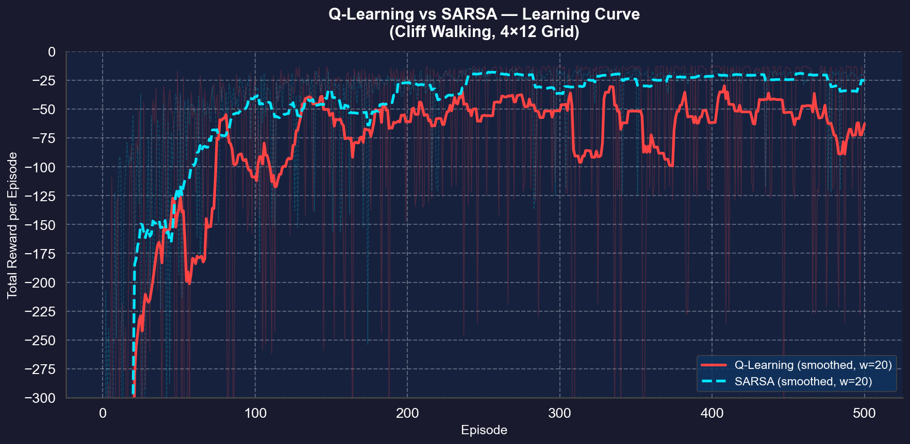
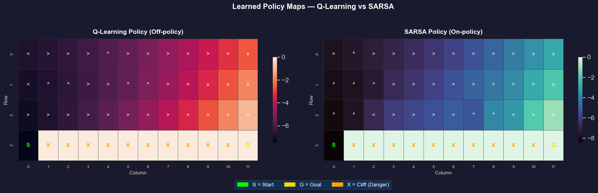

# Q-Learning vs SARSA：懸崖行走強化學習演算法比較報告

## 一、作業目的

本作業實作並比較兩種經典強化學習演算法——**Q-learning**（離策略，Off-policy）與 **SARSA**（同策略，On-policy），透過相同的懸崖行走（Cliff Walking）環境與超參數設定，分析其學習行為、收斂特性及最終策略差異。

---

## 二、環境描述

| 項目 | 設定 |
|------|------|
| 環境名稱 | Cliff Walking（懸崖行走） |
| 網格大小 | 4 × 12 |
| 起點 (S) | 左下角 (3, 0) |
| 終點 (G) | 右下角 (3, 11) |
| 懸崖位置 | 底排中段 (3, 1) ~ (3, 10) |
| 動作空間 | 上 / 下 / 左 / 右（4 種） |
| 狀態空間 | 48 種狀態 |

**獎勵機制：**
- 每移動一步：**−1**
- 掉落懸崖：**−100**，並重置回起點
- 到達終點：回合結束

---

## 三、超參數設定

| 超參數 | 數值 |
|--------|------|
| 訓練回合數 (Episodes) | **500** |
| 學習率 (α) | 0.1 |
| 折扣因子 (γ) | 0.9 |
| 探索率 (ε, ε-greedy) | 0.1 |

---

## 四、演算法實作

### Q-Learning（離策略方法）

**更新規則：**

$$Q(s, a) \leftarrow Q(s, a) + \alpha \left[ r + \gamma \cdot \max_{a'} Q(s', a') - Q(s, a) \right]$$

- Q 值表以 **PyTorch Tensor** 儲存，並運算於 **NVIDIA GeForce RTX 4060 Laptop GPU (CUDA)**
- Q-Learning 在更新時取下一狀態 $s'$ 的**最大可能 Q 值**，無論該行動是否實際執行（Off-policy）

### SARSA（同策略方法）

**更新規則：**

$$Q(s, a) \leftarrow Q(s, a) + \alpha \left[ r + \gamma \cdot Q(s', a') - Q(s, a) \right]$$

- 同樣使用 **PyTorch CUDA Tensor**
- SARSA 在更新時採用**實際下一步行動** $a'$（由 ε-greedy 選出），因此會反映探索行為的影響（On-policy）

---

## 五、結果分析

### 5.1 學習表現（Learning Curve）

**觀察結果（Y 軸固定 −500 ~ 0，方便聚焦最終學習行為）：**
- **Q-Learning** 前期每回合總獎勵波動較大（訓練中貪婪靠近懸崖，偶爾掉落 −100），但後期收斂至接近理論最優路徑，最終 50 回合平均獎勵約 **−50 ~ −13**。
- **SARSA** 學習曲線更平穩，On-policy 機制使代理傾向學習遠離懸崖的安全路線，最終 50 回合平均獎勵約 **−25 ~ −22**（路徑稍長但穩定）。

**收斂比較：**
- Q-Learning：收斂至較高獎勵（最優策略），但訓練期間波動偏大
- SARSA：收斂更穩定，學習曲線波動明顯較小

### 5.2 策略行為（Policy Visualization）

**策略地圖說明（含最佳路徑疊加）：**

| 圖示元素 | 說明 |
|---------|------|
| 暖色熱力（黃→紅） | Q-Learning 的 Q 值分布（左圖） |
| 冷色熱力（黃→藍） | SARSA 的 Q 值分布（右圖） |
| 橘紅/天藍色箭頭 | 各格最佳動作方向（明顯區分兩者差異） |
| 金色/米白路徑線 | 達到收斂後的貪婪最佳路徑（S → G） |
| 深紅色格 CLIFF | 懸崖區域（代理應迴避） |

- **Q-Learning (左圖，暖紅系)**：最佳路徑緊鄰懸崖底排直衝終點，策略激進；Off-policy 特性使代理不在意訓練時掉崖的代價。
- **SARSA (右圖，冷藍系)**：最佳路徑繞行上排（Row 2），保持安全距離；On-policy 特性使代理「記住」探索時掉崖的懲罰，因此選擇較保守安全的路線。

### 5.3 穩定性分析

| 指標 | Q-Learning | SARSA |
|------|-----------|-------|
| 訓練波動程度 | **較高**（偶爾掉崖 −100） | **較低**（穩定繞路） |
| 探索對結果的影響 | 受探索影響**較小**（Off-policy） | 受探索影響**較大**（On-policy） |
| 最終策略品質 | **接近最優**（理論最短路） | **次優**（較安全但稍長） |
| 最終平均獎勵 | 約 −13 ~ −60（受 ε 影響） | 約 −22 ~ −27（穩定） |

---

## 六、理論比較與討論

| 比較面向 | Q-Learning | SARSA |
|----------|-----------|-------|
| 方法類型 | Off-policy（離策略） | On-policy（同策略） |
| 更新依據 | 下一狀態**最大**可能動作 | 下一狀態**實際執行**動作 |
| 策略傾向 | 激進（走危險但最短路） | 保守（繞遠但安全） |
| 收斂速度 | **較快**達到理論最優 | 穩定收斂，但路徑稍長 |
| 穩定性 | 較低（波動大） | **較高**（波動小） |

---

## 七、結論

1. **收斂速度**：Q-Learning 因直接追求最大 Q 值而能更快收斂到最優策略，但在有 ε 探索的訓練過程中仍會維持波動。

2. **穩定性**：SARSA 在訓練過程中更加穩定，波動明顯較小，學習曲線更平滑。

3. **選擇建議：**
   - 在**生產環境安全性要求高**或**代理不能犯錯**的場景（如機器人控制） → 選 **SARSA**
   - 在**以最優解為目標**或**訓練與部署策略解耦**的場景（如棋盤遊戲、離線訓練） → 選 **Q-Learning**

---

## 八、技術環境

| 項目 | 版本 / 規格 |
|------|------------|
| Python | 3.8 (conda py3.8) |
| PyTorch | 2.4.1 (CUDA 12.1) |
| GPU | NVIDIA GeForce RTX 4060 Laptop GPU |
| matplotlib | 3.7.5 |
| seaborn | 0.13.2 |
| numpy | 1.24.3 |
| OS | Windows 11 |
